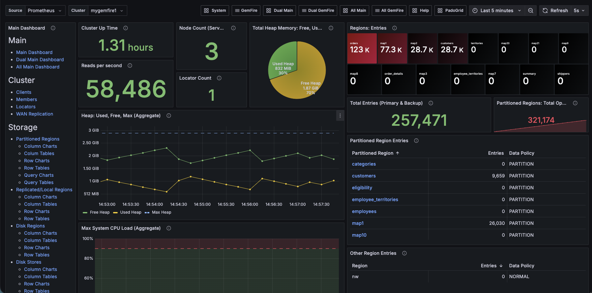
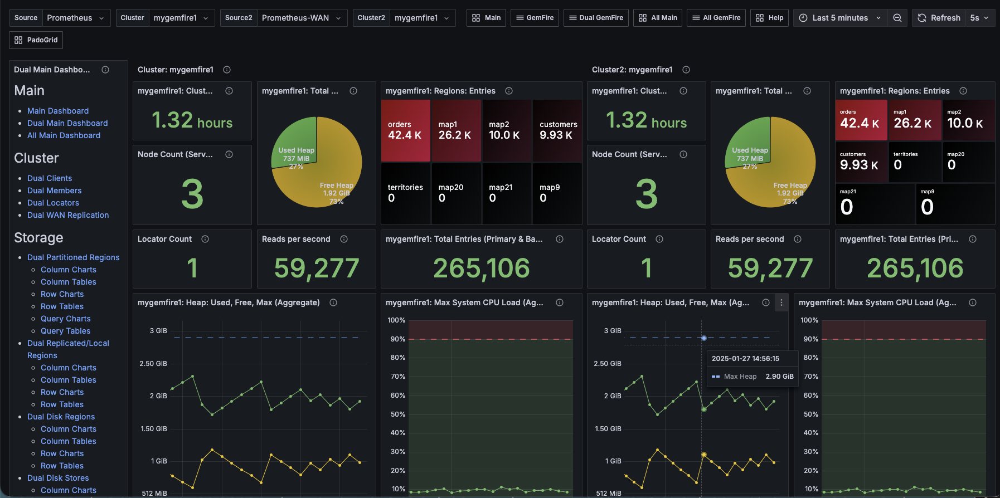
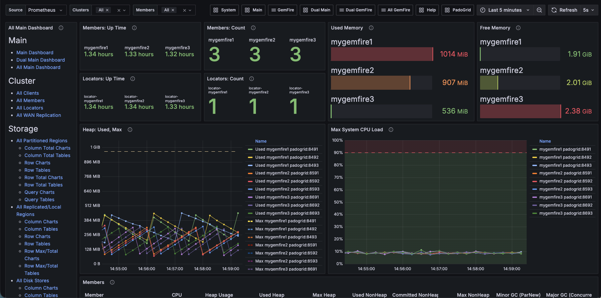
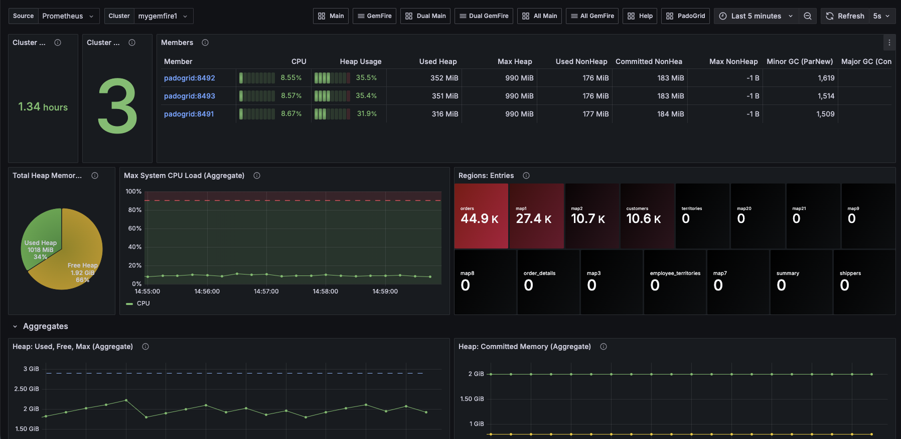

 [*PadoGrid*](https://github.com/padogrid) | [*Catalogs*](https://github.com/padogrid/catalog-bundles/blob/master/all-catalog.md) | [*Manual*](https://github.com/padogrid/padogrid/wiki) | [*FAQ*](https://github.com/padogrid/padogrid/wiki/faq) | [*Releases*](https://github.com/padogrid/padogrid/releases) | [*Templates*](https://github.com/padogrid/padogrid/wiki/Using-Bundle-Templates) | [*Pods*](https://github.com/padogrid/padogrid/wiki/Understanding-Padogrid-Pods) | [*Kubernetes*](https://github.com/padogrid/padogrid/wiki/Kubernetes) | [*Docker*](https://github.com/padogrid/padogrid/wiki/Docker) | [*Apps*](https://github.com/padogrid/padogrid/wiki/Apps) | [*Quick Start*](https://github.com/padogrid/padogrid/wiki/Quick-Start)

---

<!-- Platforms -->
[](https://github.com/padogrid/padogrid/wiki/Platform-Host-OS) [](https://github.com/padogrid/padogrid/wiki/Platform-VM) [](https://github.com/padogrid/padogrid/wiki/Platform-Docker) [](https://github.com/padogrid/padogrid/wiki/Platform-Kubernetes)

# GemFire Multi-Cluster Grafana Demo

This workspace bundle automatically installs the `grafana` app included in PadoGrid 1.0.2+ and supplemental scripts for driving the demo.

Please see [Release Notes](RELEASE_NOTES.md) for change logs.

## Installing Bundle

❗️ Before installing this bundle, create and switch to a GemFire cluster configured with GemFire 10.1.0+. This is required due to the auto-intialization step performed by this bundle.

```bash
install_bundle -init -checkout bundle-gemfire-10-cluster-wan-app-grafana
```

## Use Case

This demo bundle configures five (5) GemFire clusters, one (1) `grafana` app, and two(2) `perf_test` apps as shown below. The `perf_test` app is used to ingest data into all the clusters.


## Screenshots

### Single Main Dashboard

The Single dashboards monitor one GemFire cluster at a time. 



### Dual Main Dashboard

The Dual dashboards monitor two (2) GemFire clusters side-by-side.



### All Main Dashboard

The All dashboards monitor multiple GemFire clusters in a single view.



### System Dashboard

The System dashboard monitors individual and aggregated system resources.



## Many Other Dashboards

There are numerous dashboards orginized by Cluster, Storage, Compute, Distribution, and OS (Linux) as shown in the left pane of the Main dashboards.

## Required Software

- PadoGrid 1.0.2+
- GemFire 10.1.0+
- GemFire Management Console 1.3+
- Grafana 11.x, 10.x
- Prometheus 2.x
- Maven 3.x
- jq 1.x

## Required Hardware

- Linux OS
- \>16 GB (~10 GB for non-wan clusters) RAM
- \>30 GB Disk Space

## Bundle Contents

```console
bundle-gemfire-grafana
├── apps
│   ├── grafana
│   │   ├── bin_sh
│   │   └── etc
│   └── perf_test
│       ├── bin_sh
│       └── etc
└── clusters
    ├── mygemfire1
    │   ├── bin_sh
    │   ├── etc
    │   └── pom.xml
    ├── mygemfire2
    │   ├── bin_sh
    │   ├── etc
    │   └── pom.xml
    ├── mygemfire3
    │   ├── bin_sh
    │   ├── etc
    │   └── pom.xml
    ├── wan1
    │   ├── bin_sh
    │   ├── etc
    │   └── pom.xml
    └── wan2
        ├── bin_sh
        ├── etc
        └── pom.xml
```

## Used Ports
The following ports are used by this demo.

- Grafana: 3000
- Prometheus: 9090, 9091
- GemFire

| Cluster      | Locators      | Servers       | Locator Prometheus | Server Prometheus | HTTP Service  | Server HTTP |
| ------------ | ------------- | ------------- | ------------------ | ----------------- | ------------- | ----------- |
| `mygemfire1` | [10434-10436] | [40404-40413] | **[8481-8483]**    | **[8491-8499]**   | [7470]        | [7480-7488] |
| `mygemfire2` | [10534-10536] | [40504-40513] | **[8581-8583]**    | **[8591-8599]**   | [7570]        | [7580-7588] |
| `mygemfire3` | [10634-10636] | [40604-40513] | **[8681-8683]**    | **[8691-8699]**   | [7670]        | [7680-7688] |
| `wan1`       | [10734-10736] | [40704-40713] | **[8781-8783]**    | **[8791-8799]**   | [7770]        | [7780-7788] |
| `wan2`       | [10834-10836] | [40804-40813] | **[8881-8883]**    | **[8891-8899]**   | [7870]        | [7880-7888] |

## Apps

### grafana

The `grafana` app contains scripts for starting and stopping Grafana and Prometheus. This app has been configured to scrape metrics from the GemFire clusters `mygemfire1`, `mygemfire2`, `mygemfire3`, `wan1` and `wan2`. Grafana and Prometheus are accessible as follows.

- Grafana: [http://0.0.0.0:3000](http://0.0.0.0:3000)
- Prometheus for `mygemfire` clusters: [http://0.0.0.0:9090](http://0.0.0.0:9090)
- Prometheus for `wan` clusters: [http://0.0.0.0:9091](http://0.0.0.0:9091)

### perf_test

The `perf_test` app is for ingesting test data into clusters. It allows you to read and write mock data to individual clusters. We will be using the app to simulate workflows that actively interact with the clusters.

## Clusters

### mygemfire1, mygemfire2, mygemfire3

The `mygemfire1`, `mygemfire2`, `mygemfire3` clusters run independently without WAN replication configured.

### wan1

The `wan1` cluster defines `wan1-to-wan2` gateway senders for replication data over the WAN to the `wan2` cluster.

### wan2

The `wan2` cluster defines `wan2-to-wan1` gateway senders for replication data over the WAN to the `wan1` cluster.

## Updating Prometheus Configuration Files (Optional)

✏️  *This section is for your information only. The steps shown below are automatically done by PadoGrid when you installed the bundle.*

Because GemFire binds the host address to the Prometheus endpoint, `localhost` cannot be used in the Prometheus configuration files. To resolve this issue, the `etc/config_templates` directory has been created to isolate the working configuration files so that you can make changes without impacting `git`. Copy the configuration templates into the `etc` directory and update the host address as shown below.

```bash
# Change directory
cd_app grafana/etc

# Copy all configuration files to etc.
cp config_templates/* .

# Update the EIB address
sed -i "s/HOST-ADDRESS/`hostname`/g" *.yml
```

## Adding Members to Clusters (Optional)

✏️  *This bundle automcatically configures the clusters with one (1) locator and three (3) members for each cluster.* 

To view the member counts, run the following:

```bash
show_cluster -all
```

To add more locators or members to a cluster, run `add_locator` or `add_member`. For example, the following adds one (1) locator and one member (1) to the `wan1` cluster.

```bash
add_locator -cluster wan1
add_member -cluster wan1
```

To start the added locators and members, run the `start_cluster` command, which starts only the locators and members that are not currently running.

```bash
start_cluster -cluster wan1
```

To remove locators or members, run the following (Note that these commands will fail if they are still running):

```bash
remove_locator -cluster wan1
remove_member -cluster wan1
```

## Generating GemFire Dashboard Templates (Optional)

✏️  *This bundle includes the default set of generated dashboards, which may not include some stats that were not captured during development. The missing stats can be captured by running the scripts described in this section.*

You can generate dashboards including a complete list of GemFire statistics as shown below. The generated dashboards are useful for quickly navigating through individual stats to determine the ones that are suited for your needs.

```bash
# Change directory to the grafana app's bin_sh directory
cd_app grafana/bin_sh

# First, export the template folder from Grafana
./export_folder -folder GemFireTemplates

# Convert all the exported dashboards in the folder to templates
./export_to_template

# Generate templates. This command invokes all generate_* commands.
./generate_all
```

Once the templates are generated, place them in the `etc/dashboards/` directory and execute the following commands to import them back to Grafana.

```bash
# Copy the entire directory of the generated templates
cp -r ../templates/GemFireTemplates ../etc/dashboards/

# Delete the existing folder in Grafana
./delete_folder -folder GemFireTemplates

# Import the generated templates into Grafana
./import_folder -folder GemFireTemplates
```

Now, go to the browser and select *Home/Dashboards/GemFireTemplates*.

✏️  *The dashboards in the GemFireTemplates folder are also selectable from the *Others* left-pane menu in the **Main** dashboard.*

## Startup Sequence

### 1. Start clusters

The following starts `mygemfire` clusters, `mygemfire1`, `mygemfire2`, and `mygemfire3`.

```bash
# Start mygemfire1, mygemfire2, mygemfire3
start_group -group mygemfire
```

The following starts the `wan` clusters, `wan1` and `wan2`.

```bash
# Start wan1, wan2
start_group -group wan
```

### 2. Start Prometheus and Grafana

- Start Promtheus for the `mygemfire` clusters. Also, start Grafana for monitoring both `mygemfire` and `wan` groups of clusters.

```bash
cd_app grafana/bin_sh
./start_prometheus
./start_grafana
```

To view Prometheus and Grafana statuses:

```bash
./show_prometheus
./show_grafana
```

- Start Prometheus for the `wan` clusters.

```bash
./start_prometheus_wan
```

### 3. Set user and password from Grafana

URL: [http://0.0.0.0:3000](http://0.0.0.0:3000)

From the Grafana login prompt, set the user name and password. This bundle uses the following user name and password.

```console
user: admin
password: padogrid
```

If you want to use a different user and password, then you can change them in the following file.

```bash
cd_app grafana/bin_sh
vi setenv.sh
```

### 4. Import all dashboards into Grafana

```bash
cd_app grafana/bin_sh
./import_folder -all
```

### 5. Open Grafana in the browser

 *Connections/Add new connection* from the left pull-out menu.
- Search and add `Promtheus` from the *Add new connection* page.
- Enter the following

  Prometheus server URL: <http://localhost:9090>
- Select *Save & test* at the bottom.
- If you have the `wan` clusters running, then add another Prometheus datasource with the following URL. You can use any name.
  
  Prometheus server URL: <http://localhost:9091>

	Alternatively, if you are using PadoGrid v0.9.33+, then you can add a new Prometheus datasource as follows.

	```bash
	cd_app grafana/bin_sh
	./create_datasource_prometheus -datasource Prometheus-WAN -url http://localhost:9091
	```

Open the **00Main** dashboard.

- Select *Dashboards* from the left pull-out menu.
- Select *GemFire*.
- Select **00Main**.

The **00Main** dashboard is the main (home) dashboard that provides a menu of all available dashaboards for displaying a single cluster at a time. From there, you can navigate to **00MainDual** for monitoring two (2) clusters side-by-side and **00MainAll** for monitoring all clusters in federated views. See [Navigating GemFire Dashboards](#navigating-gemfire-dashboards) for dashboard instructions.

### 5. Ingest data with `perf_test`

#### 5.1. Ingest Northwind (nw) mock data

The `group-factory-er.properties` file is configured to write and read objects that are modeled after the Microsoft's Northwind (nw) database. The `wan` clusters are configured to replicate the `nw` data over the WAN.

First, we need to download the `javafaker` package for generating mock data by building the `perf_test` app.

```bash
cd_app perf_test1/bin_sh
./build_app
```

Now, execute the following commands to ingest `nw` data any of the clusters. For example, the following ingests `nw` data to `mygemfire1` and `wan1`

```bash
cd_app perf_test1/bin_sh
./test_group -run -prop ../etc/group-factory-er.properties -cluster mygemfire1
./test_group -run -prop ../etc/group-factory-er.properties -cluster wan1
```

#### 5.2. Ingest WAN data

To test off-heap memory and eviction, use `group-eviction.properties` as follows.

✏️ Note that `group-eviction.properties` works with the `wan` clusters only.

```bash
# wan1
./test_group -run -prop ../etc/group-eviction.properties -cluster wan1

# wan2
./test_group -run -prop ../etc/group-eviction.properties -cluster wan2
```

#### 5.3. Execute Search (Lucene) Queries

To monitor Search (Lucene) indexes and queries, execute the following `gfsh` script.

```bash
cd_app perf_test/bin_sh
# mygemfire1
gfsh -e "connect --locator=localhost[10434]" -e "run --file=search-lucene-queries.gfsh"
# mygemfire2
gfsh -e "connect --locator=localhost[10534]" -e "run --file=search-lucene-queries.gfsh"
# mygemfire3
gfsh -e "connect --locator=localhost[10634]" -e "run --file=search-lucene-queries.gfsh"
# wan1
gfsh -e "connect --locator=localhost[10734]" -e "run --file=search-lucene-queries.gfsh"
# wan2
gfsh -e "connect --locator=localhost[10834]" -e "run --file=search-lucene-queries.gfsh"
```

#### 5.4 Simulate workflows

The included `etc/group-workflow.properties` file simulates workflows by executing various GemFire data structure operations. You can run it per cluster as follows.

```bash
cd_app perf_test/bin_sh

# mygemfire1
./test_group -run -prop ../etc/group-workflow.properties -cluster mygemfire1

# mygemfire1
./test_group -run -prop ../etc/group-workflow.properties -cluster mygemfire2

# mygemfire1
./test_group -run -prop ../etc/group-workflow.properties -cluster mygemfire3

# wan1
./test_group -run -prop ../etc/group-workflow.properties -cluster wan1

# wan2
./test_group -run -prop ../etc/group-workflow.properties -cluster wan2
```

## Teardown

```bash
# First, stop perf_test if running by ctrl-C

# Stop Grafana and its Prometheus
cd_app grafana/bin_sh
# '-all' stops both mygemfire and wan Prometheus instances
./stop_prometheus -all
./stop_grafana

# Stop all clusters running in the workspace
stop_workspace -all
```

## References

1. [Grafana Documentation](https://grafana.com/docs/), Grafana official documentation.
1. [PadoGrid Manual](https://github.com/padogrid/padogrid/wiki), PadoGrid official manual.
1. [Prometheus Documentation](https://prometheus.io/docs/prometheus/latest/), Prometheus official documentation.
1. [Installing JupyterLab for PadoGrid](README_JUPYTER.md), JupyterLab installation instructions.

---

 [*PadoGrid*](https://github.com/padogrid) | [*Catalogs*](https://github.com/padogrid/catalog-bundles/blob/master/all-catalog.md) | [*Manual*](https://github.com/padogrid/padogrid/wiki) | [*FAQ*](https://github.com/padogrid/padogrid/wiki/faq) | [*Releases*](https://github.com/padogrid/padogrid/releases) | [*Templates*](https://github.com/padogrid/padogrid/wiki/Using-Bundle-Templates) | [*Pods*](https://github.com/padogrid/padogrid/wiki/Understanding-Padogrid-Pods) | [*Kubernetes*](https://github.com/padogrid/padogrid/wiki/Kubernetes) | [*Docker*](https://github.com/padogrid/padogrid/wiki/Docker) | [*Apps*](https://github.com/padogrid/padogrid/wiki/Apps) | [*Quick Start*](https://github.com/padogrid/padogrid/wiki/Quick-Start)
